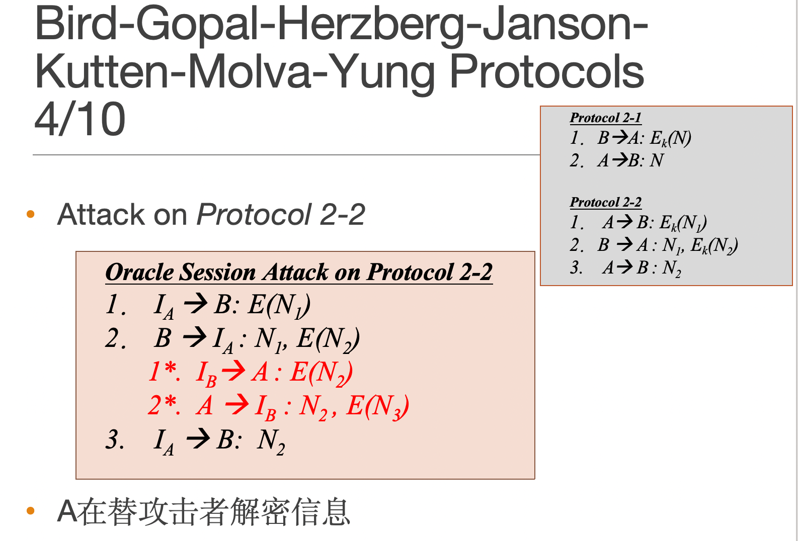
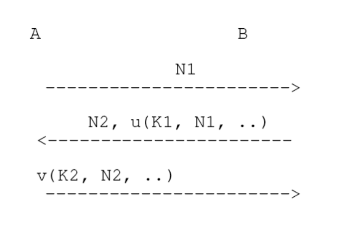
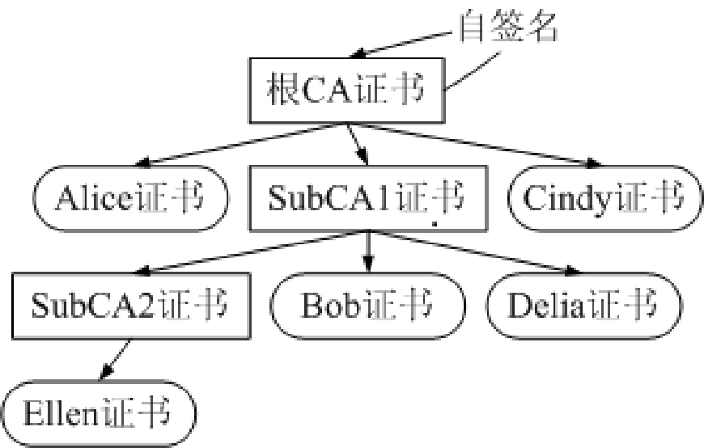
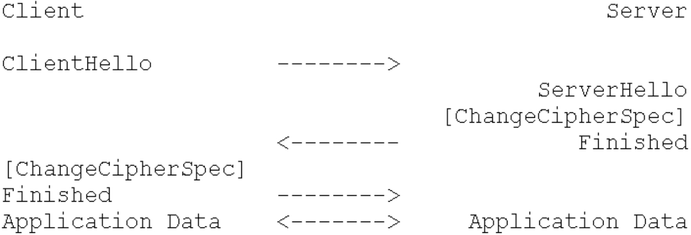

# 网络认证技术

下周一 1.15 18:10-20:40

地点：108 109

题型：

1. 判断 2分
2. 简答 5-8分

## 第一章 导言

标识Identification：在一定范围内，唯一确定地区分各实体的命名体系或方法。

鉴别Authentication：通常指身份鉴别，即，获知通信对方的身份标识的过程。

数据源鉴别：Data Source Authentication，即，在通信中，获知数据生成方或发送方的身份标识的过程。

认证Certification：证实某特定实体具有某种或某些属性。

## 第二章 密码学基础

对称密码：DES、AES、ZUC(流密码)、SM4(分组密码)

通常而言，流密码算法的资源占用更少(在相同安全强度下)

**对称密码的优缺点：**

- 运行占用空间小，加/解密速度快 
- 需要事先共享密钥。通过安全通道共享密钥，N方通信，共需N×(N－1)个密钥：数量太大。密钥分配中心（Key Distribution Center，KDC）：成为安全和性能的瓶颈
- **无法完成数字签名**。验证的人，无法生成数字签名

**避免几种误解：**

- 非对称密码学比对称密码学更安全。加密方法的安全性依依赖与密钥的长度和破译密文所需的计算。
- 对称密码学已过时。非对称密码学通常所需计算量较大，常用于密钥管理与签名。

公钥Public Key，公开的密钥，记为PubK，加密密钥Encryption Key。

私钥Private Key，秘密保存的密钥，记为PriK，解密密钥Decryption Key，签名密钥Sign Key

非对称密码算法：RSA、ElGamal、ECC、SM2

椭圆曲线密码（ECC）：

依据是定义在椭圆曲线点群上的离散对数问题的难解性。  ECC算法和ElGamal算法是类似的不同点在于：ElGamal是素域上的计算ECC是椭圆曲线域上的计算

ECC算法的特点：

ECC算法的安全性是基于椭圆曲线域上的离散对数困难问题。和RSA相比，ECC可以用小得多的密钥大小，达到相同的安全强度（破解算法所需的计算量）。可用较短密钥，达到高安全性，减少了存储、传输、计算开销(密钥长度相同时，RSA与ECC的计算量差不多)。**不等于“ECC算法比RSA算法安全”**

非对称算法的速度远远慢于对称算法。RSA算法的加密比解密快，签名验证比签名快

Hash函数：

- 将任意长度的消息压缩到固定长度的消息摘要（Message Digest）的函数。
- 散列函数，也称为消息摘要算法、杂凑算法
- Hash函数表示为h=H(M)
- 消息摘要（Message Digest）: Hash函数的输出
- 用途：数字签名、消息鉴别码（MAC）的构造，也就是HMAC。

Hash的特性：

- 输入M为变长的消息，输出为定长的hash值h
- 单向性：从M计算h比较容易，从h计算M计算上不可能
- 抗弱碰撞：对任何给定的消息x,找到满足y≠x且H(x)=H(y)的y,在计算上不可行
- 抗强碰撞：找到任何满足H(x)=H(y)的偶对(x,y)在计算上不可行
- 输入的微小变化，会引起输出的巨大变化

常见的Hash算法：md4、md5、SHA-1、SHA-256、SHA-384、SHA-512、SHA-3、**SM3（输出32字节）**

分组密码算法工作模式：ECB、CBC、CFB、OFB、CTR

CTR：为保证相同的明文+相同的加密密钥，输出的密文不相同，Counter需要随机取值。

数字签名Digital Signature：

- 签名者事后不能否认自己的签名（不可否认性）
- 接收者能够验证签名（可验证性）
- 任何其他人都不能伪造签名（不可伪造）
- 当双方关于签名的真伪发生争执时，有第三方能够解决双方的争执（第三方可验证）

消息鉴别码(MAC)：

- 验证消息的完整性
- 验证消息来源的可靠性
- 来源于特定的发起方，且中间没有被改动
- 数字签名也消息鉴别的一种方法。MAC的计算速度更快；实际中，会结合使用

HMAC：使用已有HASH算法生成的MAC

可鉴别加密(Authenticated Encryption)：一个计算过程同时实现对于数据的机密性与完整性保护

## 第三章 口令鉴别

针对口令本身的攻击：

- 弱口令：字典攻击、口令猜测

- 社会工程学：电信诈骗、钓鱼网站

针对服务器的攻击：

- 服务器存储口令明文、可用于重放的或可被破解的非明文口令数据。恶意的人员（黑客、管理员）获取存储在服务器端的用户账号信息，进而获得口令

针对网络通信的攻击：

- 窃听消息获取口令。
- 重放攻击、服务器端欺骗攻击、并行会话攻击等，均无需获取口令明文。

## 第四章 基于密码技术的鉴别

Nonce:一个只被使用一次的任意或非重复的随机数值，用于抗重放攻击 Replay Attack

**通信双方的能力不同**

通用框架：通过nonce抵抗replay attack

- K1和K2是秘密信息
- u()和v()是函数
- 挑战者使用N1和N2，一次性随机数
- 抵抗replay attack
- 通用形式不限定`u()`和`v()`，`K1/K2`可能相同或不同，对称/非对称

One-pass unilateral authentication(UNI.TS)：

## 第五章 PKI基本结构

**CA**,Certification Authority(认证机构)：权威的第三方

- 真实性－数据源鉴别，的确来自CA
- 完整性－发布的信息没有被篡改
- 非否认－CA发布之后，不能否认

以数字签名的方式：

- 签发证书（Certificate）,有数字签名
- 发布订户（Subscriber）的公钥。订户：证书的持有者

CA要有自己的证书和私钥

- CA进行数字签名
- 因为在CA发布的过程中，有同样的安全需求
- 用户拿到CA发布的证书，也有数据源鉴别、完整性的要求
- 要验证“证书是否被篡改、是否来自权威的CA”

RA(Registration Authority)，注册机构，为了解决信息审查（CA在签发证书之前，必须验证信息的正确性，当订户众多的时候，对于CA将是繁重的工作）：

- 负责进行各种信息审查
- RA可以有多个，并行地处理。审核之后，交给CA，由CA签发证书

**CA分层：**

- 在各地区建立Subordinate CA，由统一的CA给这些Subordinate CA签发证书
- 每个Sub CA维护自己的系统和用户。根CA签发了Sub CA的证书之后，二者之间的业务数据通信就很少了

将签发“自签名证书”的CA，称为根CA（Root CA）。他的下级，都称为子CA （Subordinate CA）（Sub CA）

**Repository**，资料库，用于发布CA系统的各种公开信息，例如证书、CRL、CP、CPS、OCSP、通知公告等

CRL,Certificate Revocation List，证书撤销列表，包含当前所有被撤销证书的信息。被撤销证书的信息应该被放到CRL中。

**CRL Issuer，专门负责签发CRL**

- 负责接收和处理RA发送来的撤销信息
- 定期签发CRL，可以更加频繁，缩短撤销信息的延迟

**但是CRL仍然具有局限性：**

- 撤销信息的延迟
- CRL是定期发布的

**OCSP，Online Certificate Status Protocol：**

- 一种通信协议，专门用于检查证书是否已经被撤销，相应的服务器称为OCSP Server。
- PKI User向服务器发出查询请求，OCSP服务器的响应可能是：Good、Revoked、Unknown（未撤销、已经撤销、未知）
- 因为OCSP提供的也是证书的撤销信息，所以，一般将其归入资料库的一部分
- **它是比较特殊的、PKI专有的**

PKI系统组件：

- CA
- RA
- Repository
- CRL Issuer
- OCSP Server

证书签发->证书发布->证书撤销

X.509版本3：

- **证书扩展(Certificate Extension)是在X.509标准证书版本3中才出现**

## 第六章 PKI证书编码

ASN.1 Abstract Syntax Notation One(抽象语法符号.1)，用于给出描述各种不同的数据结构

DER:Distinguished Encoding Rules

基本数据类型：

- INTEGER
- BOOLEAN
- NULL,普通RSA签名算法的参数就是NULL
- OCTET STRING
- OBJECT IDENTIFIER
- BIT STRING
- UTCTime
- GeneralizedTime

关键字：

- SEQUENCE,SEQUENCE OF,SEQUENCE SIZE () OF
- SET,SET OF,SET SIZE () OF,
- ANY DEFINED BY
- OPTIONAL
- CHOICE
- DEFAULT

编码：将数据结构对应到二进制串

DER编码，编码由TLV组成：

- Type类型－1字节
  - 例如INTEGER, BIT STRING, BOOLEAN
  - 给出了规定的Type标识
- Length长度－有多个字节（至少1个）
  - Value的长度，in bytes
- Value－共有Length个字节
  - 真实的内容

LENGTH的表示方法：

- Short Form，Value的长度是0－127
- Long Form，Value的长度大于127

Value的正负数：

- 使用补码表示法

OBJECT IDENTIFIER （OID）：

- 可以表示任何事物
- 以1.6.88.55.9547等的形式
  - 有序的、多个非负整数的组合
  - 第1个整数必须是{0,1,2}
    - 0表示ITU/CCITT
    - 1表示ISO
    - 2表示其他
    - 当第1个整数是0或1时，第2个整数必须是{0,1,…,39}

BIT STRING：

- 任意的bit串
  - 长度可能不是8的倍数
  - 因为DER编码的结果，是以字节为单位的，所以，必须经过一定的填充方法
- Type－0x03

GeneralizedTime：

- Type是0x18
- 使用了4位ASCII码来表示年份
- 对于秒，还可以包含小数点后3位

OPTIONAL：

- 表示该项可以不存在
  - 如果有值，就直接进行编码
  - 如果没有值，就直接跳过

SEQUENCE：

- Value，将各项的编码结果，按顺序排列

**tag：**

- 为了解决前面提到的解码时候的混乱问题（因为有OPTIONAL，而且，相邻的多个数据项的类型是一样的）
- 我们前面提到Type字节，在各种情况下会变化的，有tag等因素的影响，INTEGER的Type字节不一定就编码为02

## 第七章 证书扩展

如果想在证书中，带有更多的其他信息，就要以证书扩展的形式。

应用系统在使用证书时，如果碰到了不认识的扩展（不知道如何去解码），应该如何处理？

- 在每个扩展项中，包括了critical，称为扩展的关键度，为TRUE表示关键扩展，为FALSE表示非关键扩展。用于辅助PKI应用系统处理扩展项的信息
- 关键扩展：直接认为该证书是非法证书
- 非关键扩展：忽略跳过该扩展项

证书拓展：

1. Basic Constraints：用于区分是否是CA证书以及路径的深度
2. **Authority Key Identifier：CA密钥标识，用于标识CA的某一个密钥/证书对。用“Issuer+证书序列号或者用相应公钥的唯一标号。authorityCertIssuer和authorityCertSerialNumber应该同时出现，且authorityCertIssuer指的是“用来验证的CA证书”的签发者，不是CA本身而是上级CA。**
3. Subject Key Identifier：区分某人的多个密钥/证书对，一般，使用订户公钥的HASH结果作为Subject Key Identifier。
4. Key Usage：在证书中需要区分密钥的用途。1个证书可以同时用于多种用途
5. Private Key Usage Period：说明相应私钥的使用期限（对于数字签名，要求私钥使用期较短但公钥使用期较长）。
6. Issuer Alternative Name：专门放置签发者(CA)的各种不同的命名
7. Subject Alternative Name：证书订户的各种命名。
8. Subject Directory Attributes：加入任何与Subject有关的信息（属性）
9. Name Constraints：限制CA所能够签发证书的订户的名字空间。Name Constraints只是出现在CA证书中并不是出现在订户证书中。
10. Certificate Policies：区分不同证书的安全等级，简称CP，以OID的形式。CP出现在CA证书，表示该CA可以签发包含这几种CP的订户证书.CP出现在订户证书，说明对应的订户证书的安全等级和可使用的范围。
11. Inhibit Any-Policy：仅用于CA证书，值N用于表示在证书路径中，本证书之下的N个证书可带有Any-Policy的证书。
12. Policy Mappings：仅存在于交叉证书中，说明了不同CA域之间的CP等级的相互映射关系
13. Policy Constraints：对于证书认证路径的策略映射过程中，有关CP的处理，进行限制
14. Extended Key Usage：以OID的形式，给出了证书/密钥可用的用途
15. CRL Distribution Points：以证书扩展的形式，给出了“检查本证书所需要的CRL文件，到什么地方获取”，DP
16. Freshest CRL：用在增量CRL情况下，获取最新的增量CRL的地址。

## 第八章 PKI信任体系

POP：Proof of Possession (POP) of Private Key，证明订户拥有“其提交的公钥相对应的私钥”的证据

信任锚 Trust Anchor：在信任传递（也就是建立证书路径）的过程中，需要有信任的起点，称为信任锚（例如根CA）

各种信任模型：

- 单根CA

  - 基本模型Base Model。系统中只有1个根CA，也就是只有1个信任锚。没有信任传递，因为所有的PKI User都信任根CA。
    - 特点：验证证书简单，缺少扩展能力，CA出问题就是信任锚出问题。
      

  - 严格层次模型Strict Hierarchy。为了更好保护信任锚。多个CA，形成层次结构。多次信任传递。

    - 特点：只有信任锚有自签名证书；信任锚之外的CA没有自签名证书，由其上级CA向其签发证书；每个CA最多只有1个上级CA；信任锚保护。

    

- 多根CA。因为现实的原因，单根CA的环境是不可能的，除非是很小的环境。

  - 证书信任列表Certificate Trust List，CTL。

    - 用户自主处理，每个用户要自主地处理信任锚。
    - 权威发布方式，由权威机构统一地发布1个可信的信任锚列表即CTL。
    - 特点：验证简单，证书认证路径构造简单；CTL由某个CA/or 权威机构发布，该CA负责对其他根CA的考察、安全地得到其证书，验证者应用程序同时识别多套Certificate Policy；

  - 鉴定证书Accreditation Certificate。引入了Accreditation CA（简称ACA），专门地解决信任锚问题的CA。ACA有自签名证书，给其他根CA签发Accreditation Certificate。

    - 信任锚变化：除了已有的信任锚，还要加入ACA，ACA的作用仅仅用来传递信任锚，说明哪些根CA是可以信任的。
    - 改变信任锚会有问题。信任锚，作为用户信任的起点，不应该被轻易改动。信任锚的增加，就意味着要信任一大批人:该根CA直接或者间接签发的所有订户证书。一旦改变、难以被变化，因为要大量的用户、一一地操作删除。因此与其他PKI域进行互联的时候，应该尽量不改变本域用户的信任锚，也就有了下面的几种多根CA模型。

    

  - 交叉认证Cross Certification。本域的CA给其他域的CA签发证书，使得信任传递的范围扩大。验证时，相当于将对方CA，视为我方的SubCA。

    - 优点：这种信任也可以很方便地、动态取消（使用证书撤销技术），可以控制。由CA统一完成；没有改变信任锚。

  

  - 网状Mesh。网状模型并不是一种专门的模型，多次交叉认证，就形成网状。

  

  - 桥CA Bridge CA。引入了专门的、处理交叉认证的机构，称为Bridge CA。BCA与每个CA进行双向交叉认证，从而能够连通所有的CA。
    - 有自己的密钥、自签名证书
    - 桥CA制定自己的一套CP，然后与各PKI信任域的信任锚进行交叉认证，同时，进行策略映射，映射到桥CA制定的CP。

## 第九章 证书撤销

Revocation：CA告知各PKI User，某个还在证书有效期内的证书不再有效

撤销的方法：

- CA/CRL Issuer定期地签发CRL
- OCSP/证书撤销树CRT

证书验证：

- 构造证书路径
- 对于证书路径中的每个证书，验证是否处于有效期，验证CA签名是否有效，检查撤销状态（对于证书有效性的最基本检查，还要检查各种证书扩展）

CRL相关概念：

- 完全CRL－Complete CRL。被撤销的证书序列号都是存在于同一个CRL文件中
- 增量CRL－Delta CRL。给出了相对于某次完全CRL的撤销列表的变化量
- 直接CRL－Direct CRL。证书的签发者就是CRL的签发者
- 间接CRL－Indirect CRL。使用专门的CRL Issuer签发的CRL
- CRL分发点－CRL Distribution Point。获取CRL的地址，也就是CA/CRL Issuer公布CRL的地址。
- CRL拆分：依赖CRL Distribution Point技术，将CRL拆分为多个文件。拆分的依据由CA自己决定，可以是序列号，可以是撤销原因

OCSP的由来：

- 尽管我们可以对CRL文件一再拆分，但是，不应该是太小。
- CRL文件有可能比较大
- 特定场合/应用环境的需求

OCSP的Response消息：

- 必须带有签名，替换攻击
- 必须带有有效时间，重放攻击。时间戳produceAt防重放，如果Client看到produceAt与当前时间相差太久，就可能是攻击。
- OCSP服务器必须有自己的证书。

CRL和OCSP：

- 对于CRL，列表长、数据量大
- 对于OCSP，需要服务器不断地签名
- 折中：CRT

CRT 证书撤销树技术－Certificate Revocation Tree，一种基于2叉HASH树的方式。

- 优点：???

  

## 第十章

### 10.1 SSL协议

TLS协议是IETF将SSL协议的进一步标准化，基本上，SSL 3.0等于TLS 1.0。

TLS协议结构：

TLS/Record依赖于TCP实现，因为TCP提供有序的可靠传输，TCP的功能正是TLS所需要的。所以，TLS/Record必须建立在TCP之上或者是其它的可靠连接。

Record层：当TLS协商之后、无错误地运行、传输Application Data时，主要就是Record层在起安全保护作用：

最基本的Handshake协议过程：

- ClientHello：支持的最高协议版本，32 bytes随机数，Session ID
- ServerHello：32 bytes随机数，选定的协议版本和算法，Session ID
- Certificate：Server证书链
- ServerHelloDone：表明ServerHello 结束，等待client回应
- ClientKeyExchange：根据SeverHello选定的密钥协商算法，生成并回复48字节PreMasterSecret并用Server证书公钥加密。
- ChangeCipherSpec：通知Server启用协商好的算法，Client切换Write State，Server切换Read State
- Finished，数据信息被保护的第一个消息。
- ChangeCipherSpec：通知Client启用协商好的算法，Server切换Write State，Client切换Read State
- Finished。
- 双方接到对方的Finished消息、校验没有问题后开始传输Application Data。

Client和Server共享了如下信息：

- 32字节Client.random  （ClientHello）
- 32字节Server.random （ServerHello）
- 48字节Premaster secret（秘密）

安全会话重用：由于进行Handshake的计算量较大,之前协商过的各种参数，假设双方都记住，可以重用。

- 第一次，在协商的过程中，ServerHello中给出Session ID。如果Server不给Session ID，则不想重用

- 第二次，Client想要重用，在ClientHello中，设为上次的“Session ID”，表示想要重用。如不想重用，则ClientHello中，没有Session ID。

- Server收到ClientHello，发现带有Session ID，查找自己的缓存，有相同的Session ID且Server允许重用则回应ServerHello，也带有相同的Session ID表示同意重用，不需要再重新协商。然后，直接切换算法ChangeCipherSpec，发送Finished消息。

  

OpenSSL的HeartBleed攻击：申请的内存过大导致攻击。

（**没看**）

TLS1.3：

- 和TLS1.2的区别：

  - 身份鉴别支持Pre-shared key（PSK）模式
  - 在ServerHello之后的消息都被加密
  - 取消了ChangeCipherSpec消息功能

- 协议流程：
  

- Handshake–Authentication：

  

### 10.2 Wi-Fi

Wi-Fi认证方案（总结）：

eduroam：

- Eduroam是一个分层的RADIUS 服务器网络
- RADIUS 层次架构的作用是：把用户身份转发到用户身份所属的机构，在那里验证用户身份的有效性
  

## 第十二章 PKI 安全增强

本章由两部分组成：

- 入侵容忍的CA系统
- 信任增强的PKI体系

入侵容忍 Survivability技术：在系统遭到（部分）入侵的情况下，仍然能够提供正常服务——CA系统正常服务

PKI信任机制的安全问题：

- CA并不是完全可信，CA可能发布虚假证书。
- 虚假证书：证书可以被验证通过，但是证书对应的私钥并不被证书主体拥有，而是被其他人拥有
- 原因：不严格的审查、操作失误、系统入侵、当地政府或管理机构强制要求

PKI信任机制的基本假设：相信CA

- 行为不会出错，证书中的信息都是准确无误的。
- 无限制权力，可以为任何实体/网站域名签发证书

PKI信任机制的增强方案

- 安全增强的基本思路1：在浏览器端实施检测，是否可能是虚假证书？CA行为有可能出错
- 安全增强的基本思路2：限制CA权力，CA并不能任意地为任意TLS服务器签发证书
- 安全增强的基本思路3：证书透明化Certificate Transparency：审计CA，行为有可能出错

## 第十三章 证书透明化

虚假证书 fraudulent certificate：证书可以被严格验证通过，但是证书对应的私钥并不被证书主体拥有，而是被其他人拥有

现实中，CA机构会因为各种原因签发虚假证书

- 不严格的审查
- 操作失误
- 系统入侵
- 当地政府或管理机构强制要求

Google提出证书透明化方案（Certificate Transparency, CT）。

CT的系统原理：

- 基本思想：将所有由CA签发证书记录在一个公开的日志(public log)中，不出现在公开日志中的证书，不会被用户接受。
- 证书透明化系统在传统PKI体系下增加以下角色：
  - 公开日志服务器（Public Log Server）：保存和维护记录证书的公开日志（Public Log）
  - 监视员（Monitor）周期性的访问公开日志服务器，寻找和发现可疑的证书
  - 审计员（Auditor）审计公开日志的行为

增强的证书验证方式：

- 收到证书并验证通过后，公开日志服务器会向提交者返回一个凭据（SCT，Signed Certificate Timestamp），这个凭据将伴随着证书的整个生命周期。

- 在证书验证前，用户应随证书一同获得对应该证书的凭据。
- 特别的，在一个SSL/TLS链接中，TLS服务器应该在链接协商阶段提供相应的凭据验证证书的同时，用户验证凭据的有效性凭据无效时，用户拒绝该证书
- 凭据是用户接受证书的必要条件。
- Chrome浏览器，要求在TLS握手过程中至少2个SCT

凭据，签名的证书时间戳（Signed Certificate Timestamp, SCT）：

- 用户不仅需要验证证书，还需要验证相应的SCT
- SCT的优点：
  - 简化在SSL/TLS过程中，浏览器的工作
  - 不是实时地连接Log Server、进行查找，避免网络延迟
- 如何得到SCT：
  - 从X.509证书扩展项获得SCT
  - 从连接建立时TLS扩展项获得SCT
  - 从OCSP stapling的扩展项获得SCT

SCT获取方式比较：

| **CT支持方式** | **CA**涉及的改动                                             | **TLS**服务器涉及的改动                    | **浏览器涉及的改动**                                         |
| -------------- | ------------------------------------------------------------ | ------------------------------------------ | ------------------------------------------------------------ |
| 证书扩展       | 证书签发流程更改 预证书、最终证书两次签名 从Log Server获取SCT |                                            | 可解析证书中的SCT扩展 验证证书时，需验证SCT签名         |
| TLS扩展        | 无                                                           | 获取最终证书对应的SCT。 TLS支持CT扩展 | 可解析并获取TLS中的SCT。 验证证书时，需验证SCT签名      |
| OCSP Stapling  | OCSP改造  获取证书对应的SCT OCSP响应中返回SCT      | 支持OCSP Stapling                          | 支持OCSP Stapling 可解析并获取OCSP响应中的SCT 验证证书时，需验证SCT签名 |

其中证书扩展的方式对TLS Server及Client总体改动需求最小目前使用最为广泛。

公开日志：

- 公开日志是一个唯一的、一直增长的、append-only的Merkle Hash Tree
- 每个被接收的证书，都对应于一个叶子节点

## 第十四章 隐式证书

隐式证书（Implicit Certificate）：

- 公钥证书的一种“变体”；
- 典型方案是基于 ECC 算法的 ECQV 隐式证书方案；
- 有一定的适用范围,在带宽、计算能力、存储资源有限制的环境下，是传统X.509证书的一种高效替代；

X.509证书 VS 隐式证书：

- 证书内容：隐式证书省去了X.509证书中的CA数字签名部分，用中间公钥数据P_U  + 订户身份标识取代
- 密钥对生成：
  - 传统证书，如X.509证书，密钥对的生成与证书的颁发是独立的两个过程； 证书颁发前，用户需要向CA证明自己拥有相应的私钥
  - 隐式证书，证书颁发和密钥对的生成是一个互相依赖的过程；证书颁发前，用户不知道自己最终的公私钥对的值；
- 计算比较：
  - X.509： 需要对订户证书进行CA签名的验证
  - 隐式证书：需要重构出订户公钥，在对消息的验签时同时完成对证书本身的验证

车联网中的隐私要求：

- 匿名：数字证书上的身份标识，与真实身份无关
- 不可关联- Unlinkability：每一车辆拥有多张假名证书，随时切换使用
- 可监管（或者说， Unlinkability => Linkability）：特定条件的匿名解除和假名关联

## 第十五章 Kerberos

Kerberos特点：

- 使用共享秘钥加密技术的可信第三方身份验证服务
- 提供相当的安全性
  - 在每个Client和Server之间建立了共享密钥
  - 可以保护网络实体免受窃听和重放攻击 
- 支持SSO(Single Sign On)，用户只需输入一次身份验证信息就可以凭借此验证获得的票据(TGT)访问多个服务

Kerberos基本流程，主要包括三个部分：Kerberos对用户的初始认证，使用TGT获得Service Ticket,拿着Service Ticket向Service Server获取服务

用户的长期密钥(主密钥kC)是从用户的口令中派生出来的。用户口令短，容易受到字典攻击。

## 第十八章 OAuth OIDC

单点登录/Single Sign on SSO：

- 只需进行一次用户身份验证，用户就可以访问其拥有访问权限的所有计算机和系统，而无需输入多个密码
- 优点：简化用户操作；简化管理.
- SSO的解决方案：
  1. Pseudo-SSO。本地代理组件 or服务器SP:是Service Provider。
     
  2. 真正的SSO：各SP信任SSO系统，用户登录SSO、完成身份鉴别，然后就可以直接登录各SP。
     

比较：

- Pseudo-SSO
  - 优点：原有SP不需要改动
  - 不足：简化用户、不简化管理
- SSO
  - 优点：同时简化用户和简化管理
  - 不足：需要系统改动

OAuth2.0的Abstract Protocol Flow：

OpenID Connect(OIDC)：

- OpenID Connect 1.0 是 OAuth 2.0 协议之上的一个简单身份层(simple identity layer)

这张图是一个OpenID Connect (OIDC) 授权码流程的图示，用来描述在用户、客户端（Relying Party）、授权服务器和OpenID提供者（OpenAM）之间如何进行身份验证和授权。以下是流程的步骤解释：

1. **准备授权请求（Relying Party）**：客户端（依赖方）准备一个向授权服务器发送的授权请求。这通常包括指定所请求的作用域（scope）、响应类型和客户端标识符。
2. **授权请求（Relying Party -> Authorization Server）**：客户端将上一步准备好的授权请求发送到授权服务器。
3. **验证终端用户（End User -> Authorization Server）**：授权服务器要求终端用户进行身份验证，这通常涉及输入用户名和密码。
4. **同意/授权（End User -> Authorization Server）**：一旦验证身份，用户需要给予客户端访问其信息的同意和授权。
5. **重定向与授权码（Authorization Server -> End User）**：授权服务器将用户重定向回客户端，并附上一个授权码。
6. **……授权码（End User -> Relying Party）**：用户的浏览器将授权码发送回客户端。
7. **授权码（Relying Party -> Token Endpoint）**：客户端使用接收到的授权码，向令牌端点发送请求以交换访问令牌和ID令牌。
8. **访问令牌和ID令牌（Token Endpoint -> Relying Party）**：令牌端点验证授权码，如果验证成功，将向客户端发放访问令牌和ID令牌。
9. **验证ID令牌并获取终端用户主体ID（Relying Party）**：客户端验证ID令牌的完整性和有效性，并从中提取终端用户的主体标识符（Subject Identifier）。
10. **（可选）访问令牌（Relying Party -> UserInfo Endpoint）**：如果需要，客户端可以使用访问令牌向用户信息端点请求更多用户信息。
11. **（可选）用户信息响应（UserInfo Endpoint -> Relying Party）**：用户信息端点验证访问令牌，如果有效，返回请求的用户信息。

这个流程允许客户端安全地验证用户的身份，并且按照用户的授权获取必要的信息，而不需要用户将密码直接提供给客户端。这是一种常见的用于Web应用、移动应用和API安全的认证和授权机制。

## 第十九章 FIDO

基于移动终端可信环境的身份鉴别

- 在服务器端将用户与移动终端的可信环境进行身份绑定
- 将用户与服务器之间的直接鉴别转变为两段式鉴别：移动终端鉴别用户，网络服务鉴别移动终端。

Fast Identity Online(FIDO)：

- FIDO 协议使用标准的公钥加密技术来提供更强的身份验证功能
- FIDO 架构包括三个关键协议：
  - UAF(Universal Authentication Framework)
  - U2F(Universal 2nd Factor)
  - CTAP(Client to Authenticator Protocols )

？？？

## 第二十章 多种类型的身份鉴别

多因素身份鉴别：

- 同时使用多种因素
- 攻击者必须同时攻击多种机制，才能成功
- 同时验证多个身份因素
  - Password+动态口令
  - Password+USBKey
  - Password+生物特征
- USB Key+PIN不是多因素鉴别。PIN用于访问USBKey中存储的私钥，而非验证用户身份